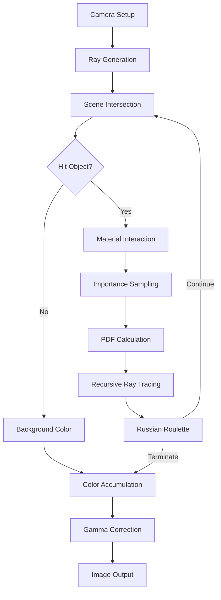
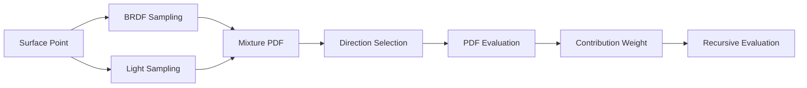
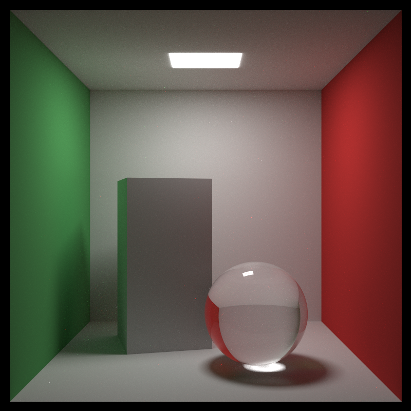
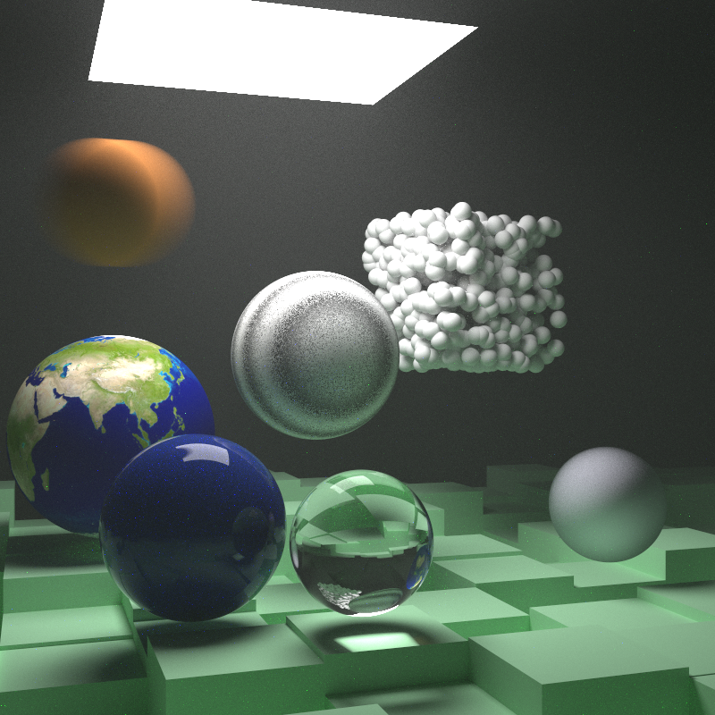

# Ray Tracing: The Rest of Your Life - Rust Implementation

A modern Rust implementation of advanced ray tracing techniques based on "Ray Tracing: The Rest of Your Life", focusing on Monte Carlo methods and performance optimization.

## Features

- **Monte Carlo Path Tracing**: High-quality global illumination simulation
- **Importance Sampling**: Smart light source sampling for faster convergence
- **PDF System**: Support for various sampling distributions
- **Volume Rendering**: Smoke, fog and volumetric scattering effects
- **BVH Acceleration**: Efficient ray-scene intersection acceleration
- **Procedural Textures**: Perlin noise and checker pattern textures
- **Parallel Rendering**: High-performance parallel computation with Rayon
- **Modern Rust**: Type-safe, memory-safe, zero-cost abstractions

## Project Structure

```
src/
├── main.rs                          # Main program entry
├── lib.rs                           # Library entry and documentation
├── scenes/                          # Scene definitions
│   ├── mod.rs
│   ├── cornell_box.rs               # Cornell box scenes
│   └── final_scene.rs               # Complex final scene
└── ray_tracing/                     # Core ray tracing library
    ├── math/                        # Mathematical foundations
    ├── materials/                   # Material system
    ├── geometry/                    # Geometry system
    ├── acceleration/                # Acceleration structures
    ├── volumes/                     # Volume rendering
    ├── sampling/                    # Sampling system
    ├── rendering/                   # Rendering pipeline
    ├── procedural/                  # Procedural generation
    └── utils/                       # Utility functions
```

## Rendering Pipeline



## Monte Carlo Integration Flow



## Quick Start

### Requirements

- Rust 1.70 or higher
- Cargo package manager

### Installation and Usage

```bash
# Clone repository
git clone https://github.com/Rukkhadevata123/RayTracing_Rust.git
cd RayTracing_Rust

# Build project
cargo build --release

# Run different scenes
cargo run --release cornell    # Cornell box scene
cargo run --release final      # Final complex scene
cargo run --release quick      # Quick test version
```

### Custom Configuration

```rust
// Modify configuration in scenes/cornell_box.rs
let config = CornellBoxConfig {
    image_width: 800,
    samples_per_pixel: 5000,
    max_depth: 50,
    output_filename: "my_render.png".to_string(),
};
```

## Rendering Examples

### Cornell Box with Glass Sphere



High-quality Cornell box scene featuring:

- Soft shadows from diffuse surfaces
- Glass sphere refraction and reflection
- Area light soft shadows
- Color bleeding effects

### Complex Final Scene



Complex scene with multiple materials and effects:

- Procedural noise textures
- Volume scattering (smoke effects)
- Motion blur
- Mixed material types

## Core Technical Implementation

### Monte Carlo Path Tracing

```rust
fn ray_color(&self, r: &Ray, depth: i32, world: &dyn Hittable, 
             lights: Option<&Arc<dyn Hittable>>) -> Color {
    if depth <= 0 { return Color::zeros(); }
    
    // Ray-scene intersection
    if !world.hit(r, Interval::new(0.001, f64::INFINITY), &mut rec) {
        return self.background;
    }
    
    // Material scattering + importance sampling
    let scattered_direction = importance_sample(&rec, lights);
    let pdf_value = calculate_pdf(&scattered_direction);
    
    // Recursive tracing + Russian roulette optimization
    emission + (attenuation * scattering_pdf * 
               self.ray_color(&scattered, depth - 1, world, lights)) / pdf_value
}
```

### Importance Sampling System

```rust
// Mixture PDF: light sampling + BRDF sampling
let light_pdf = Arc::new(HittablePDF::new(light_objects, &rec.p));
let mixture_pdf = MixturePDF::new(light_pdf, material_pdf);

let direction = mixture_pdf.generate();
let pdf_value = mixture_pdf.value(&direction);
```

## Performance Optimizations

### Parallel Rendering

- **Rayon data parallelism**: Parallel pixel row processing
- **SIMD vectorization**: Automatic vectorization with nalgebra
- **Memory locality**: Optimized data structure layout

### Algorithm Optimizations

- **Russian roulette**: Adaptive path termination
- **Importance sampling**: Variance reduction for faster convergence
- **BVH acceleration**: O(log n) intersection complexity
- **Stratified sampling**: Reduced sampling variance within pixels

### Performance Benchmarks

| Scene | Resolution | Samples | Render Time | Configuration |
|-------|------------|---------|-------------|---------------|
| Cornell Box | 600×600 | 1000 | ~5 minutes | 8-core CPU |
| Final Scene | 800×800 | 5000 | ~45 minutes | 8-core CPU |
| Quick Test | 400×400 | 100 | ~30 seconds | 8-core CPU |

## Mathematical Foundation

### Rendering Equation

```
L_o(p,ω_o) = L_e(p,ω_o) + ∫_Ω f_r(p,ω_i,ω_o) L_i(p,ω_i) (n·ω_i) dω_i
```

Where:

- `L_o`: Outgoing radiance
- `L_e`: Emitted radiance  
- `f_r`: BRDF
- `L_i`: Incoming radiance

### Monte Carlo Estimation

```
⟨F⟩ ≈ (1/N) Σ f(X_i)/p(X_i)
```

Variance reduction through importance sampling.

## Architecture Highlights

### Rust-Specific Design

- **Zero-cost abstractions**: Efficient trait object dispatch
- **Ownership system**: Memory-safe parallel computation
- **Type safety**: Compile-time error checking
- **Functional features**: Map/reduce parallel patterns

### Design Patterns

- **Strategy pattern**: Material and PDF traits
- **Decorator pattern**: Geometric transformation system
- **Builder pattern**: Scene construction
- **Factory pattern**: Texture and material creation

## Development

### Build and Test

```bash
# Format code
cargo fmt

# Check code
cargo clippy

# Run tests
cargo test

# Generate documentation
cargo doc --open
```

## License

MIT License - see [LICENSE](LICENSE) file

## References

- [Ray Tracing in One Weekend](https://raytracing.github.io/books/RayTracingInOneWeekend.html)
- [Ray Tracing: The Next Week](https://raytracing.github.io/books/RayTracingTheNextWeek.html)
- [Ray Tracing: The Rest of Your Life](https://raytracing.github.io/books/RayTracingTheRestOfYourLife.html)
- [Physically Based Rendering](http://www.pbr-book.org/)
